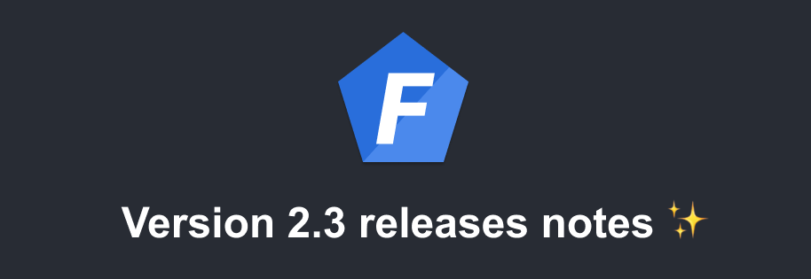

Version 2.3 of Foal has been released! Here are the improvements that it brings.

<!--truncate-->

## GraphiQL

From version 2.3, it is possible to generate a GraphiQL page in one line of code. This can be useful if you quickly need to test your API.

```bash
npm install @foal/graphiql
```


*app.controller.ts*
```typescript
import { GraphiQLController } from '@foal/graphiql';

import { GraphqlApiController } from './services';

export class AppController {

  subControllers = [
    // ...
    controller('/graphql', GraphqlApiController),
    controller('/graphiql', GraphiQLController)
  ];

}
```

The page is also customizable and you can provide additional options to change the UI or the API endpoint.

```typescript
export class GraphiQL2Controller extends GraphiQLController {

  cssThemeURL = 'https://cdnjs.cloudflare.com/ajax/libs/codemirror/5.23.0/theme/solarized.css';

  apiEndpoint = '/api';

  options: GraphiQLControllerOptions = {
    docExplorerOpen: true,
    editorTheme: 'solarized light'
  }

}

```

## Support for `.env.local` files

Foal's configuration system already supported `.env` files in previous versions. As of version 2.3, the framework also supports `.env.local` files.

This can be useful in case you want to have two `.env` files, one to define the default env vars needed by the application and another to override these values on your local machine.

If a variable is defined in both files, the value in the `.env.local` file will take precedence.

Similarly, you can also define environment-specific local files (`.env.development.local`, `.env.production.local`, etc).

## Base 64 and base 64 URL utilities

Two functions are provided to convert base64 encoded strings to base64url encoded strings and vice versa.

```typescript
import { convertBase64ToBase64url, convertBase64urlToBase64 } from '@foal/core';

const str = convertBase64ToBase64url(base64Str);
const str2 = convertBase64urlToBase64(base64urlStr);
```

## Converting Streams to Buffers

In case you need to convert a readable stream to a concatenated buffer during testing, you can now use the `streamToBuffer` function for this.

```typescript
import { streamToBuffer } from '@foal/core';

const buffer = await streamToBuffer(stream);
```