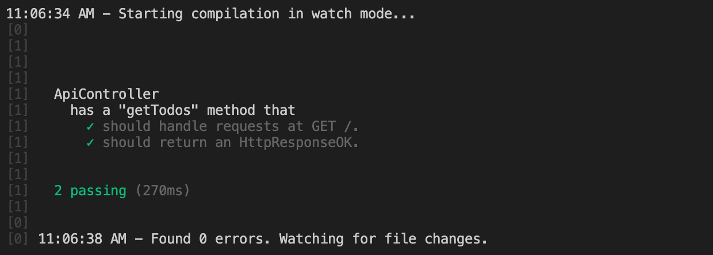

El último paso de este tutorial es añadir algunas pruebas unitarias al `ApiController`.

Un archivo de pruebas unitarias termina con la extensión `spec.ts` y suele colocarse junto al archivo que está probando.

Abra el archivo `api.controller.spec.ts` y sustituya su contenido.

```typescript
// std
// The `assert` module provides a simple set of assertion tests.
import { ok, strictEqual } from 'assert';

// 3p
import { createController, getHttpMethod, getPath, isHttpResponseOK } from '@foal/core';
import { Connection, createConnection } from 'typeorm';

// App
import { Todo } from '../entities';
import { ApiController } from './api.controller';

// Define a group of tests.
describe('ApiController', () => {

  let controller: ApiController;
  let connection: Connection;

  // Create a connection to the database before running all the tests.
  before(async () => {
    // The connection uses the configuration defined in the file config/test.json.
    // By default, the file has three connection options:
    //  "database": "./test_db.sqlite3" -> Use a different database for running the tests.
    // "synchronize": true ->  Auto create the database schema when the connection is established.
    // "dropSchema": true -> Drop the schema when the connection is established (empty the database).
    connection = await createConnection();
  });

  // Close the database connection after running all the tests whether they succeed or failed.
  after(() => connection.close());

  // Create or re-create the controller before each test.
  beforeEach(() => controller = createController(ApiController));

  // Define a nested group of tests.
  describe('has a "getTodos" method that', () => {

    // Define a unit test.
    it('should handle requests at GET /.', () => {
      // Throw an error and make the test fail if the http method of `getTodos` is not GET.
      strictEqual(getHttpMethod(ApiController, 'getTodos'), 'GET');
      // Throw an error and make the test fail if the path of `getTodos` is not /todos.
      strictEqual(getPath(ApiController, 'getTodos'), '/todos');
    });

    // Define a unit test.
    it('should return an HttpResponseOK.', async () => {
      // Create fake todos.
      const todo1 = new Todo();
      todo1.text = 'Todo 1';

      const todo2 = new Todo();
      todo2.text = 'Todo 2';

      // Save the todos.
      await connection.manager.save([ todo1, todo2 ]);

      const response = await controller.getTodos();
      ok(isHttpResponseOK(response), 'response should be an instance of HttpResponseOK.');

      const body = response.body;

      ok(Array.isArray(body), 'The body of the response should be an array.');
      strictEqual(body[0].text, 'Todo 1');
      strictEqual(body[1].text, 'Todo 2');
    });

  });

});

```

> Como un método del controlador devuelve un objeto `HttpResponse`, es realmente fácil probar el estado y el cuerpo de la respuesta.


> Si el método del controlador toma un objeto `Context` como argumento, puede instanciar uno así `nuevo Contexto({ /* contenido del objeto "request" de Express */})`.

Ejecute las pruebas.

```
npm run test
```

> Este comando vigila sus pruebas y archivos probados en los directorios `app/` y `scripts/`. Cuando se modifica un archivo, recompila automáticamente y vuelve a ejecutar sus pruebas.

Ahora debería terminar con esta salida:



¡Enhorabuena! ¡Ha llegado al final de este tutorial!

Si tiene alguna pregunta, ¡no dude en abrir una issue en Github!

> El código fuente completo está disponible [aquí](https://foalts.org/simple-todo-list-source-code-v2.zip).