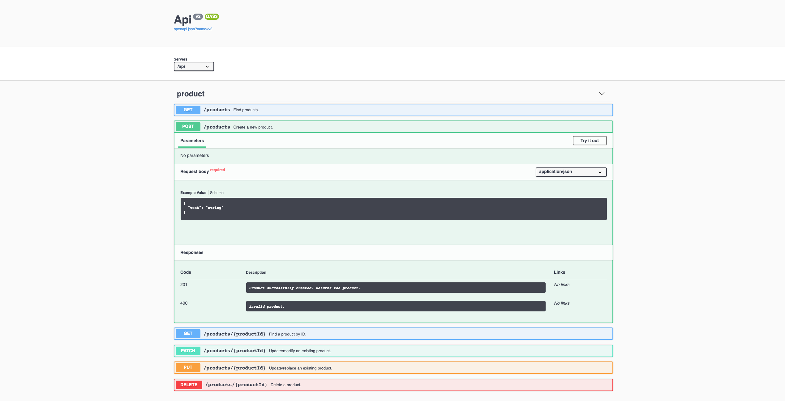

*Example:*
```
foal generate rest-api product --register
```

Building a REST API is often a common task when creating an application. To avoid reinventing the wheel, FoalTS provides a CLI command to achieve this.

```
foal generate rest-api <name> [--register] [--auth]
```

This command generates three files: an entity, a controller and the controller's test. Depending on your directory structure, they may be generated in different locations:

- If two directories `entities` and `controllers` exist, the files are created in these ones.
- Otherwise they all are created in the current directory.

The generated controller already has a set of implemented routes **that you can customize as you like**. It defines a REST API and is ready to use. The only thing to do is to connect the controller to the `AppController` or one of its children.

> The `--register` option automatically registers your controller in the `AppController`.

## The API Behavior

Below is a table summarizing how the generated API works:

| *HTTP Method* | *CRUD* | *Entire Collection (e.g. `/products`)* | *Specific Item (e.g. `/products/{id}`)* |
| --- | --- | --- | --- | --- |
| GET | Read | 200 (OK) - list of products | 200 (OK) - the product <br /> 404 (Not Found)|
| POST | Create | 201 (Created) - the created product <br /> 400 (Bad Request) - the validation error | Not implemented |
| PUT | Update/Replace | Not implemented | 200 (OK) - the updated product <br /> 400 (Bad Request) - the validation error <br /> 404 (Not Found) |
| PATCH | Update/Modify | Not implemented | 200 (OK) - the updated product <br /> 400 (Bad Request) - the validation error <br /> 404 (Not Found) |
| DELETE | Delete | Not implemented | 204 (No Content) <br /> 404 (Not Found) |

The `GET /<name>s` routes also accept two optional query parameters `skip` and `take` to handle **pagination**. If the parameters are not valid numbers, the controller responds with a 400 (Bad Request) status.

- `skip` - offset from where items should be taken.
- `take` - max number of items that should be taken.

*Example:*
```
GET /products?skip=10&take=20
```

## The Resource and its Representation

Once your API is set up, you can define its attributes.

The entity generated by default should look like this:
```typescript
import { Column, Entity, PrimaryGeneratedColumn } from 'typeorm';

@Entity()
export class Product {

  @PrimaryGeneratedColumn()
  id: number;

  @Column()
  text: string;

}
```

And the schema of your API (defined in the controller file) should look like this:
```typescript
export const productSchhema = {
  additionalProperties: false,
  properties: {
    text: { type: 'string', maxLength: 255 },
  },
  required: [ 'text' ],
  type: 'object',
};
```

The entity is the *resource*. It is the database model used internally on the server.

The schema is the *representation of the resource*. It defines the interface of the API.

In simple scenarios, the two are very similar but they can differ much more in complex applications. A resource may have several representations and it may be made of several entities.

### How to Add New Field

For example, if you want to add a `sold` boolean field whose default value is `false`, you can do the following:

*product.entity.ts*
```typescript
import { Column, Entity, PrimaryGeneratedColumn } from 'typeorm';

@Entity()
export class Product {

  @PrimaryGeneratedColumn()
  id: number;

  @Column()
  text: string;

  @Column()
  sold: boolean;

}
```

*product.controller.ts*
```typescript
export const productSchhema = {
  additionalProperties: false,
  properties: {
    sold: { type: 'boolean', default: false },
    text: { type: 'string', maxLength: 255 },
  },
  required: [ 'text' ],
  type: 'object',
};
```

## Using Authentication

If you wish to attach a user to the resource, you can use the `--auth` flag to do so.

*Example:*
```
foal generate rest-api product --auth
```

This flags adds an `owner: User` column to your entity and uses it in the API.

## Generating OpenAPI documentation

The generated controllers also have OpenAPI decorators on their methods to document the API.

In this way, when the [configuration key](../architecture/configuration.md) `settings.openapi.useHooks` is set to `true`, we can get a full documentation of the API using [Swagger UI](./openapi-and-swagger-ui.md)

.