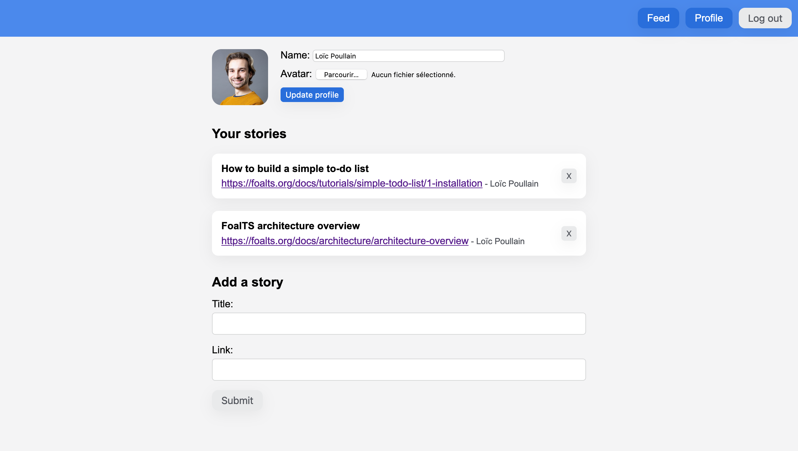

Ce tutoriel montre comment construire une application du monde réel avec React et Foal. Il suppose que vous avez déjà lu le premier guide *[Comment créer une To-Do Liste Simple](../simple-todo-list/1-installation.md)* et que vous avez une connaissance de base de React.

Dans ce tutoriel, vous apprendrez à :
- établir une connexion avec MySQL ou Postgres,
- fournir des informations d'identification à l'application de manière sécurisée,
- créer des modèles avec des relations many-to-one,
- utiliser un constructeur de requêtes,
- générer une interface pour tester votre API (Swagger UI),
- corriger les erreurs de politique de same-origin,
- permettre aux utilisateurs de se connecter et de s'enregistrer avec un email et un mot de passe,
- authentifier les utilisateurs sur le frontend et le backend,
- gérer le contrôle d'accès,
- se protéger contre les attaques CSRF,
- télécharger et enregistrer des fichiers (*file upload*),
- permettre aux utilisateurs de se connecter avec un fournisseur social (Google),
- et construire l'application pour la production.

> *Pour des raisons de simplicité, l'application frontale n'utilisera pas de bibliothèque de gestion d'état (telle que [redux](https://redux.js.org/)). Mais vous pouvez bien sûr en ajouter une si vous le souhaitez. La logique à suivre restera principalement la même.*

## Aperçu de l'Application

L'application que vous allez créer est un site Web social où les utilisateurs peuvent partager des liens intéressants vers des tutoriaux. Tous les messages seront publics, donc aucune authentification ne sera nécessaire pour les consulter. La publication d'un post, par contre, nécessitera la création d'un compte.

*Page d'accueil*


*Page de profile*


*Pages d'inscription et de connexion*


## Débuter

C'est parti. Tout d'abord, créez un nouveau répertoire.

```bash
mkdir foal-react-tuto
```

Générez l'application backend.

```bash
cd foal-react-tuto
foal createapp backend-app
```

Puis, démarrez le serveur de développement.

```bash
cd backend-app
npm run develop
```

Allez sur [http://localhost:3001](http://localhost:3001) dans votre navigateur. Vous devriez voir le message *Welcome on board*.