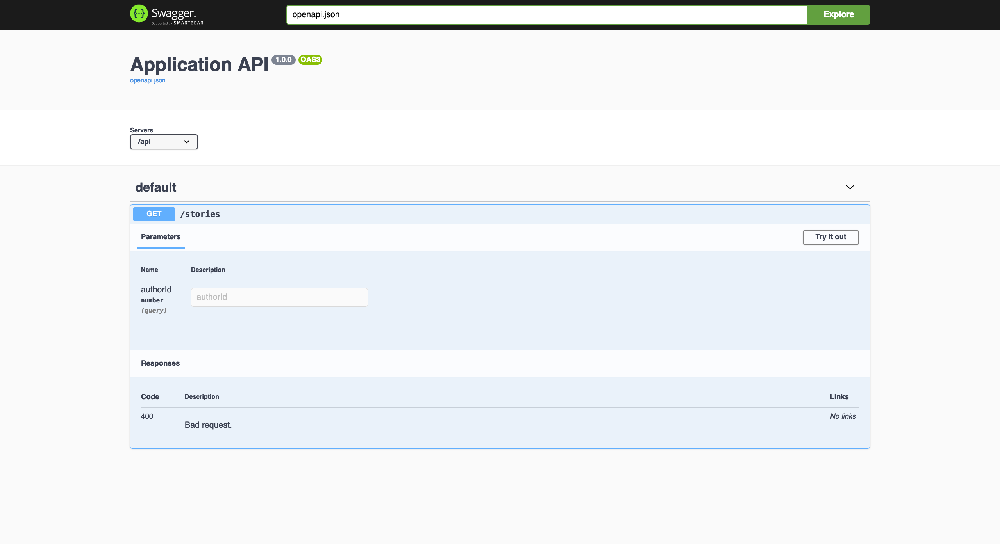

Maintenant que le premier point de terminaison a été implémenté, l'étape suivante consiste à le tester.

Pour ce faire, vous allez générer une page de documentation complète de votre API à partir de laquelle vous pourrez envoyer des requêtes. Cette page sera générée à l'aide de [Swagger UI](https://swagger.io/tools/swagger-ui/) et de la [spécification OpenAPI](https://github.com/OAI/OpenAPI-Specification/).

```bash
npm install @foal/swagger
```

Tout d'abord, fournissez quelques informations pour décrire votre API de manière globale.

```typescript
import { ApiInfo, ApiServer, controller } from '@foal/core';
import { StoriesController } from './api';

@ApiInfo({
  title: 'Application API',
  version: '1.0.0'
})
@ApiServer({
  url: '/api'
})
export class ApiController {

  subControllers = [
    controller('/stories', StoriesController),
  ];

}

```

Ensuite, générez un nouveau contrôleur. Celui-ci sera en charge du rendu de la nouvelle page.

```bash
foal generate controller openapi --register
```

Faites en sorte que la classe générée étende la classe abstraite `SwaggerController`. Et ensuite, fournissez le contrôleur racine de votre API comme option au contrôleur.

```typescript
import { SwaggerController } from '@foal/swagger';
import { ApiController } from './api.controller';

export class OpenapiController extends SwaggerController  {

  options = {
    controllerClass: ApiController
  }

}
```

Enfin, mettez à jour votre fichier `app.controller.ts` afin que la page Swagger UI soit disponible à l'adresse [/swagger](http://localhost:3001/swagger).

```typescript
import { controller, IAppController } from '@foal/core';
import { createConnection } from 'typeorm';

import { ApiController, OpenapiController } from './controllers';

export class AppController implements IAppController {
  subControllers = [
    controller('/api', ApiController),
    controller('/swagger', OpenapiController)
  ];

  async init() {
    await createConnection();
  }
}

```

Si vous naviguez vers [http://localhost:3001/swagger](http://localhost:3001/swagger), vous verrez la page de documentation générée à partir de votre code.



Cliquez maintenant sur le bouton *Try it out*. Les champs deviennent éditables et vous pouvez envoyer des requêtes pour tester votre API.

